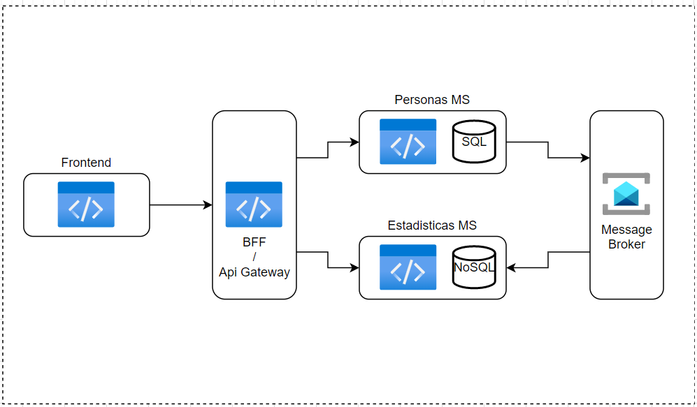
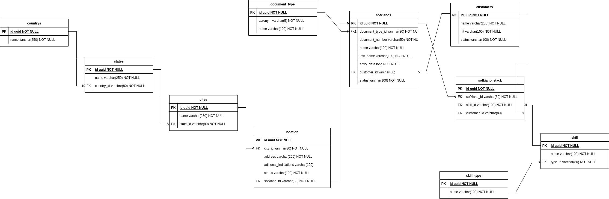

# RetoLt

## Arquitectura

## Modelo De datos

El modelo de datos está indicado para las tablas de postgresSQL.
Puede ver los script que crean las tablas e inserta datos de prueba iniciales en el siguiente enlace.
[VER SCRIPT](./assets/Script.sql)

## Tecnologias

### Backend

* Java
* Gradle
* SpringBoot
* Bancolombia Clean Architecture Plugin
* SpringJPA
* JUnit
* Mockito
* PostgresSQL
* RabbitMQ
* MongoDB

### Frontend

* React
* TypeScript
* React Router
* Jest
* Ant design
* Formik